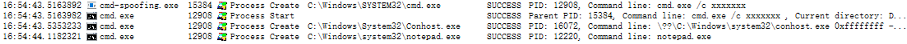

# cmd-spoofing

使用该工具可使用伪造的命令行创建目标进程，被 sysmon 或 ETW 捕获的进程创建事件日志中将显示伪造的命令行，而不是实际执行的命令行，类似于 CobaltStrike 的 argue 指令。

## 用法

cmd-spoofing.exe "cmd.exe /c xxxxxxx" "cmd.exe /c notepad.exe"

效果：



**注意：本质执行的还是同一个程序，只不过是参数的不同而已，所以要避免出现这种参数：`cmd-spoofing.exe cmd.exe notepad.exe`。**

## 编译

环境：Windows + VS2022 + CMake

可以直接在 VS2022 中打开编译，也可以使用 cmake 命令生成 build.ninja 进行编译：

```powershell
cd cmd-spoofing
cmake -S . --preset=x64-release
ninja -C out\build\x64-release
```